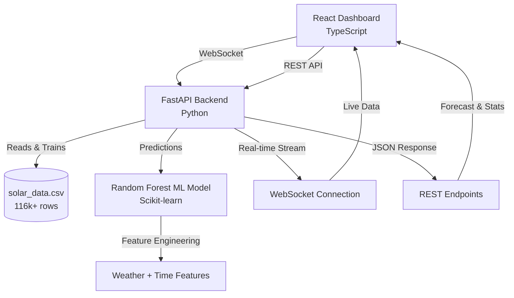

# ☀️ Smart Solar Energy Management System


> An intelligent solar energy monitoring and forecasting system powered by machine learning, providing real-time analytics and predictions for optimal energy management.

---

## 📖 Table of Contents
- [Overview](#-overview)
- [Key Features](#-key-features)
- [System Architecture](#-system-architecture)
- [Tech Stack](#-tech-stack)
- [Project Structure](#-project-structure)
- [Installation & Setup](#-installation--setup)
- [Usage](#-usage)
- [API Documentation](#-api-documentation)
- [Machine Learning Model](#-machine-learning-model)
- [Screenshots](#-screenshots)
- [Future Enhancements](#-future-enhancements)
- [Contributing](#-contributing)
- [Author](#-author)
- [License](#-license)

---

## 🌍 Overview

**Smart Solar Energy Management System** is a full-stack application that monitors, predicts, and optimizes solar energy generation using real-time data and machine learning algorithms. The system analyzes historical weather patterns and solar output to provide accurate forecasts and actionable insights.

### Why This Project?
- 🌱 **Sustainability**: Optimize renewable energy usage
- 📊 **Data-Driven**: ML-based predictions using 116k+ data points
- ⚡ **Real-Time**: Live monitoring via WebSocket connections
- 🎯 **Practical**: Actual solar dataset from real-world measurements

---

## ⚡ Key Features

### Real-Time Monitoring
- ✅ Live solar generation tracking
- ✅ Battery level monitoring
- ✅ Energy consumption metrics
- ✅ Grid export/import tracking
- ✅ Weather condition integration

### Machine Learning Predictions
- 🧠 Random Forest regression model
- 📈 24-48 hour solar output forecasting
- 🌦️ Weather-based predictions
- 📊 Model performance metrics (R², RMSE, MAE)
- 🎯 Feature importance analysis

### Interactive Dashboard
- 📱 Responsive React interface
- 🔄 WebSocket-powered live updates
- 📉 Historical data visualization
- 🌡️ Real-time weather display
- ⚙️ Connection status monitoring

---

## 🏗️ System Architecture



### Data Flow
1. **CSV Data** → Preprocessing → Feature engineering
2. **ML Training** → Random Forest model → Performance metrics
3. **Real-time Generation** → Weather simulation → ML prediction
4. **WebSocket Stream** → Live updates → Dashboard visualization
5. **REST API** → Forecasts & statistics → Frontend display

---

## 🧩 Tech Stack

| Layer | Technology | Purpose |
|-------|-----------|---------|
| **Backend** | FastAPI | High-performance async API framework |
| **ML Framework** | Scikit-learn | Random Forest regression model |
| **Data Processing** | Pandas, NumPy | Data manipulation and analysis |
| **Real-time** | WebSocket | Live data streaming |
| **Frontend** | React 18 | UI framework |
| **Type Safety** | TypeScript | Static typing for React |
| **HTTP Client** | Axios | API communication |
| **Deployment** | Uvicorn | ASGI server |

### Backend Dependencies
```
fastapi
uvicorn
pandas
numpy
scikit-learn
joblib
python-multipart
websockets
```

### Frontend Dependencies
```
react
typescript
axios
@types/react
```

---

## 📁 Project Structure

```
smart-solar-energy-management/
│
├── backend/
│   ├── data/
│   │   └── solar_data.csv          # 116k+ rows of solar/weather data
│   ├── src/
│   │   └── main.py                 # FastAPI application + ML pipeline
│   ├── venv/                       # Python virtual environment
│   └── requirements.txt            # Python dependencies
│
├── frontend/
│   ├── public/
│   │   ├── index.html
│   │   └── manifest.json
│   ├── src/
│   │   ├── components/
│   │   │   └── Dashboard.tsx       # Main dashboard component
│   │   ├── App.tsx                 # Root React component
│   │   ├── App.css                 # Styling
│   │   └── index.tsx               # React entry point
│   ├── package.json
│   └── tsconfig.json
│
└── README.md
```

---

## ⚙️ Installation & Setup

### Prerequisites
- **Python** ≥ 3.8
- **Node.js** ≥ 16
- **npm** or **yarn**
- Git

### Backend Setup

<details>
<summary><b>Click to expand backend installation steps</b></summary>

```bash
# 1. Navigate to backend directory
cd backend

# 2. Create virtual environment
python -m venv venv

# 3. Activate virtual environment
# On macOS/Linux:
source venv/bin/activate
# On Windows:
venv\Scripts\activate

# 4. Install dependencies
pip install fastapi uvicorn pandas numpy scikit-learn joblib python-multipart websockets

# 5. Place your CSV file
# Ensure solar_data.csv is in backend/data/

# 6. Run the FastAPI server
python src/main.py
```

**Backend runs on:** `http://localhost:8000`  
**API Documentation:** `http://localhost:8000/docs`

</details>

### Frontend Setup

<details>
<summary><b>Click to expand frontend installation steps</b></summary>

```bash
# 1. Navigate to frontend directory
cd frontend

# 2. Install dependencies
npm install

# 3. Start development server
npm start
```

**Frontend runs on:** `http://localhost:3000`

</details>

### Quick Start (Both Services)

```bash
# Terminal 1 - Backend
cd backend && python src/main.py

# Terminal 2 - Frontend
cd frontend && npm start
```

---

## 🚀 Usage

### Access the Application
1. Start both backend and frontend servers
2. Open browser at `http://localhost:3000`
3. View real-time solar metrics on the dashboard
4. Monitor weather conditions and predictions
5. Analyze historical trends

### API Endpoints

| Method | Endpoint | Description |
|--------|----------|-------------|
| GET | `/` | API health check & system info |
| GET | `/api/solar/current` | Current solar generation data |
| GET | `/api/solar/forecast/{hours}` | Solar forecast (up to 48 hours) |
| GET | `/api/data/stats` | Dataset statistics |
| GET | `/api/models/performance` | ML model performance metrics |
| POST | `/api/upload-csv` | Upload new training data |
| WS | `/ws` | WebSocket live data stream |

---

## 📡 API Documentation

### Example: Get Current Data
```bash
curl http://localhost:8000/api/solar/current
```

**Response:**
```json
{
  "timestamp": "2025-10-19T14:30:00",
  "solar_generation": 5.23,
  "battery_level": 78.5,
  "consumption": 3.12,
  "grid_export": 2.11,
  "weather": {
    "temperature": 24.5,
    "humidity": 65.2,
    "wind_speed": 12.3,
    "pressure": 1013.2
  },
  "using_real_data_model": true
}
```

### Example: Get 24-Hour Forecast
```bash
curl http://localhost:8000/api/solar/forecast/24
```

---

## 🧠 Machine Learning Model

### Model Details
- **Algorithm**: Random Forest Regressor
- **Training Data**: 116,117 rows from real solar installations
- **Features Used**:
  - Time-based: hour, day_of_year, month, day_of_week, is_weekend
  - Weather: temperature, humidity, wind_speed, pressure
- **Target**: Solar power generation (kW)

### Model Training Process
```python
# Features engineered from datetime and weather data
X = ['hour', 'day_of_year', 'month', 'day_of_week', 'is_weekend',
     'wind-speed', 'humidity', 'temperature', 'pressure']

# Random Forest configuration
RandomForestRegressor(
    n_estimators=100,
    max_depth=20,
    min_samples_split=5,
    min_samples_leaf=2
)
```

### Performance Metrics
The model automatically calculates:
- **R² Score**: Model accuracy
- **RMSE**: Root Mean Squared Error
- **MAE**: Mean Absolute Error
- **Feature Importance**: Which factors matter most
  
---

## 🔮 Future Enhancements

- [ ] **IoT Integration**: Connect real solar sensors
- [ ] **Cloud Deployment**: AWS/Azure hosting
- [ ] **Mobile App**: React Native version
- [ ] **Advanced ML**: LSTM for time-series forecasting
- [ ] **User Authentication**: Multi-user support
- [ ] **Database Integration**: PostgreSQL for historical data
- [ ] **Alert System**: Email/SMS notifications
- [ ] **Energy Optimization**: AI-powered recommendations
- [ ] **Weather API**: Live weather integration
- [ ] **Export Reports**: PDF generation

---

## 🤝 Contributing

Contributions are welcome! Please follow these steps:

1. Fork the repository
2. Create a feature branch (`git checkout -b feature/AmazingFeature`)
3. Commit your changes (`git commit -m 'Add some AmazingFeature'`)
4. Push to the branch (`git push origin feature/AmazingFeature`)
5. Open a Pull Request

---

## 👨‍💻 Author

**Arjav Jhamb**

- 📧 Email: [arjavjhamb22@gmail.com](mailto:arjavjhamb22@gmail.com)
- 🔗 GitHub: [@Arjav-Jhamb](https://github.com/Arjav-Jhamb)
- 💼 LinkedIn: [Connect with me](https://linkedin.com/in/arjav-jhamb) *(update with your profile)*

---

## 📜 License

This project is licensed under the MIT License - see the [LICENSE](LICENSE) file for details.

---

## 🙏 Acknowledgments

- Solar dataset from real-world installations
- FastAPI documentation and community
- React and TypeScript communities
- Scikit-learn for ML capabilities

---

<div align="center">

### ⭐ Star this repository if you find it helpful!

**Made with ☀️ and 💻 by Arjav Jhamb**

</div>
